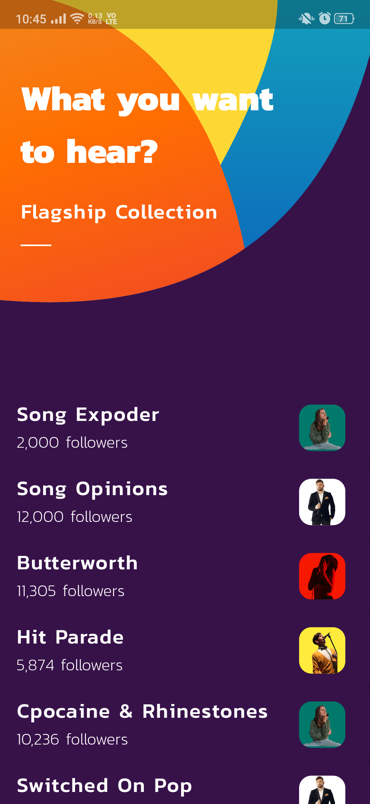
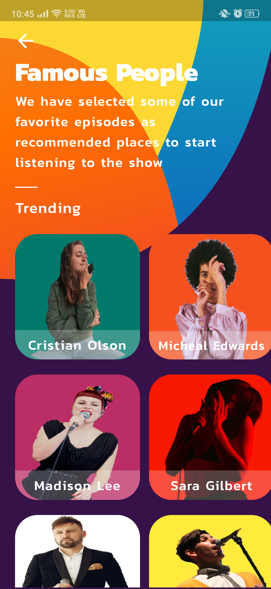
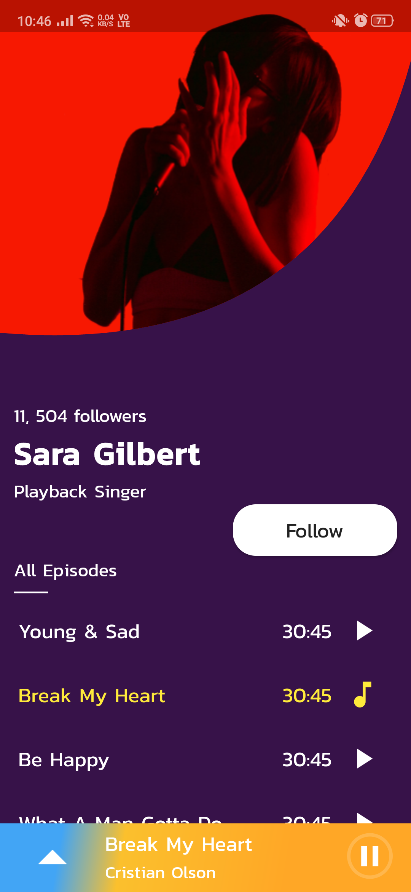

# PODCAST App

### Introduction

A demo prototype app for  listening to podcasts and it's artists.

* The UI is inpired from this [Dribble](https://dribbble.com/shots/5972331-Podcast-App-Exploration) post.
* The image resources used in this app are from [Pexels](https://www.pexels.com/).

### Some Glimpse

  
   
  

### Demo

<video width="320" height="240" controls>
  <source src="(https://drive.google.com/file/d/1eQ49NcKTcdYRhutRhoDpbq799iRbKqMS/view?usp=sharing)" type="video/mp4">
</video>

>Made with love by **Utkarsh** :heart:

>*This app is built with sole intention of exploring and showcasing UI skills :relaxed:*